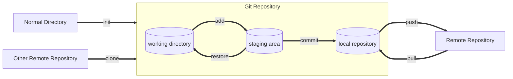
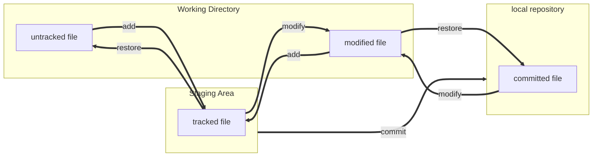
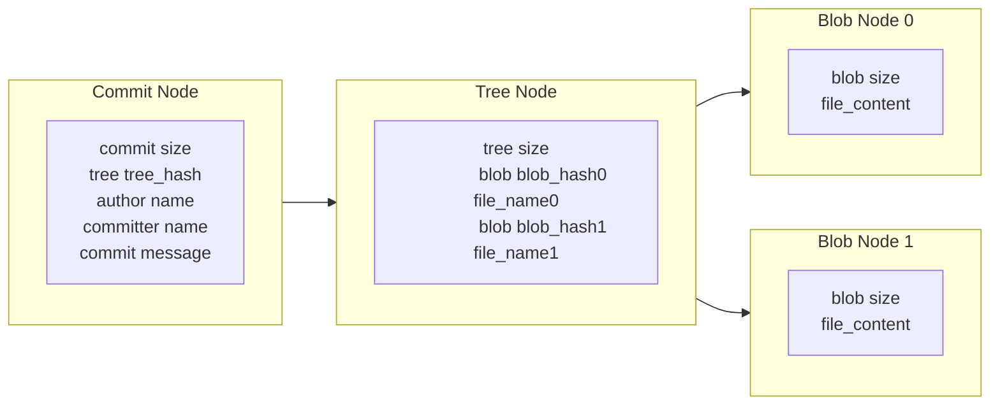
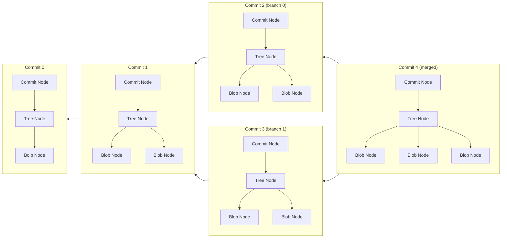

# Introduction

This is a quick note for **Git**.

To get help in Git, type `git help <operation>` or `git <operation> --help` in command line

For more info in Git, visit [Pro Git](https://git-scm.com/book/en/v2) or [Github doc](https://docs.github.com/en).


# Install Git

Visit [Git download](https://git-scm.com/downloads) to get Git installation package.


# How to Use Git

For windows:
- **CMD or powershell**
- **Git bash**
- Git GUI
- Third party software

The usage of **Git commands** in windows powershell is the focus of this note.


# Configure Git

There are three Git config files at different levels.

Three Git config files in windows 10:

1. system config file works for all login users of the OS:
    - \<git directory\>/etc/gitconfig
2. global config file works for the current login user:
    - \<user directory\>/.gitconfig
3. local config file works for the specific repository:
    - \<repository directory\>/.git/config

**The local config covers the global config, and the global config covers the system config.**

For more info, type `git config --help`.


## List Configurations

To show git configurations:

```
git config --list
```
Add option `--show-origin` to display source config file as well.


## Modify Configurations

To add a new configuration or modify an existing configuration:
```
git config [--local | --global | --system] <var> <value>
```
Use option **`--local`**, **`--global`**, or **`--system`**
to create or modify the configuration in the specific config file.

If range is not given,
the configuration in the local config file will be set.

To forcibly add a new configuration:
```
git config --add [--local | --global | --system] <var> <value>
```
If the configuration is existing,
a same configuration will be added.

To delete a configuration:
```
git config --unset [--local | --global | --system] <var>
```

To configure user name and email in global config file (usually used):
```
git config --global user.name "USER NAME"
git config --global user.email "MYEAMIAL@MINE.ME"
```

To configure gvim as default editor for git:
```
git config --global core.editor "'<gvim_path>\gvim.exe' --nofork '%*'"
```

To open an editor to modify git configurations:
```
git config [--local | --global | --system] -e
```
Additionally, the git config file can be by editor out of git.

For all available configurations, type `git config --help` to view.


# Git Work Flow

## From Perspective of Area




## From Perspective of File




## From Perspective of Node Connections




## From Perspective of Commit




# Create a Git Repository

## From a Local Directory

To initialize a local directory into a git repository:
```
cd <local_directory>
git init
```


## From an Existing Repository

To clone an existing repository from the internet or a local path:
```
git clone [-b <branch>] [--] <repository_path> [<path>]
```
If `-b <branch>` is not given,
the default branch will be cloned.

If `<path>` is not given,
a new working directory will be created to hold the repository.
The new directory will be named as the same as the repository.


## Check git Repository Status

To check the status of git repository:
```
git status
```
**This is the most often used command.**


## Delete Local Repository

To delete a git repository from local disk:
```
cd <target_repository>
rm -rf .git
```
or directly delete `.git` directory by manual operations.


## Ignore Specific Files

To ignore specific files during version controlling with git,
add a file named `.gitignore` in local repository directory.
The `.gitignore` file specifies which files are intended to be ignored.

For more info about file ignorance, check
[Git gitignore](https://git-scm.com/docs/gitignore)
or
[github gitignore](https://github.com/github/gitignore).


# Make a Commit

## Add Changes to Staging Area

To add current changes (including new files and changes of committed files) from working directory to staging area:
```
git add [<option>] [--] <file>
```

The option `-p` is used to choose which changes to be added.
The option `-i` is used to interactively add changes.


## Commit Changes to Local Repository

To commit changes from staging area to local repository and archive:
```
git commit
```

After execution of this command,
a default editor will pop up and waits for a commit message being entered.
The commit will fail without a commit message.
To forcibly give up current commit operation,
use `:cq` in vim.

To modify last commit (files or commit message):
```
git commit --amend
```
The command won't create a new commit.

However, if the last commit has successive commit or has been **pushed** to remote,
there will be a new commit generated with the same changes and new message.
In the case, consider `git rebase`.


# Recover Changes


## Discard Changes in Working Directory

To discard **changes** of the tracked files in working directory:
```
git restore [--] <file>
```
or
```
git checkout [--] <file>
```
Both commands will reload the cached or archived version of the files in the search order of:
1. **staging area**
2. **last commit**


## Discard Changes in Staging Area

To move **changes** of the staged files from staging area to working directory:
```
git restore --staged [--] <file>
```
or
```
git reset HEAD [--] <file>
```


# Remove Files

To remove committed files from next commit and working directory:
```
git rm [--] <file>
```

The above command equals to
```
rm <file>
git add <file>
```


# Show Differences


## Show Differences within Git

To show differences of in working area:
```
git diff [<option>] [[--merge-base] <commit>] [[--] <file>]
```
If `<commit>` is not given,
the differences to staging area will be shown.
If there is nothing in staging area,
the differences to last commit will be shown.

To show differences of in staging area:
```
git diff [<option>] --cached [[--merge-base] <commit>] [[--] <file>]
```
If `<commit>` is not given,
differences to the last commit (mostly HEAD) will be shown.

To show differences between two commits:
```
git diff [<option>] [--merge-base] <commit_a> <commit_b> [[--] <file>]
```

If a directory or a file path as `[--] <file>` is not given,
all files will be compared.

The `--merge-base` is used to show differences to the merge base commit
of the two given commits or the HEAD and the given commit.

The default output format:
```
diff --git a/<file_a> b/<file_b>
index <index_hash_of_file_a>..<index_hash_of_file_b> <filetype&authority>
--- a/<file_a>
+++ b/<file_b>
@@ -<start_line_number>,<total_number_of_lines> +<start_line_number>,<total_number_of_lines> @@
 <same_content>
+<unique_content_in_file_b>
 <same_content>
 <same_content>
-<unique_content_in_file_a>
 <same_content>
-<unique_content_in_file_a>
-<unique_content_in_file_a>
+<unique_content_in_file_b>
```
**By default, the older file will be marked as a,**
**and the newer file will be marked as b.**

The option `--stat` will show statistics only.


## Show Differences with Editor Tool

To show differences in an editor:
```
git difftool [-t=<tool>] <...>
```
where `<...>` are items as in `git diff`.

If the `[-t=<tool>]` is not given,
the default editor will be launched.

To show available tools:
```
git difftool --tool-help
```


# Clean Redundant Files

To simulate a clean operation:
```
git clean --dry-run
```
`--dry-run` is identical to the option `-n`.

To clean untracked files which are not ignored:
```
git clean
```
with option `-i` to run interactively,
with option `-x` to clean Git produced files which are ignored by default,
with option `-X` to clean files ignored by Git


# Commit Management

## Show Commit History

To show commit history:
```
git log [<option>] [<commit_range>] [[--] [<file_path>]]
```

To change the message format:
|Option             |Description                                        |
|:---               |:---                                               |
|`--graph`          |show branch history with graphic description       |
|`--shortstat`      |show abbreviated stats for each commit             |
|`--stat`           |shorten `--stat` info                              |
|`--name-only`      |show names of changed files                        |
|`--name-status`    |show changes of changed files                      |
|`--pretty`         |show commits with alternate format                 |
|`--oneline`        |shorthand for `--pretty=oneline --abbrev-commit`   |

To choose commits to be printed:
|Option                     |Description                                        |
|:---                       |:---                                               |
|`--all`                    |show all branches and commits                      |
|`-<N>`                     |only last N commits                                |
|`--first-parent`           |only show the first parent commits                 |
|`-g`                       |show commits by time order                         |
|`--since` or `--after`     |only commits after the specific date               |
|`--until` or `--before`    |only commits before the specific date              |
|`--grep`                   |only commits with messages containing the string   |
|`-S`                       |only commits changing code matching the string     |
|`--author`                 |only commits with matched author                   |
|`--committer`              |only commits with matched committer                |

The `--all`, `-<N>`, and `--first-parent` are useful for commit history view.
The `-g` is important for lost commit finding.

`git log -p [[-L <start_line>,<end_line>:]<file>]` could generate diff output of the `<file>` between commits.


## Commit Indexing

|Method                             |Which Commit                   |
|:---                               |:---                           |
|`<branch>`                         |last commit of `<branch>`      |
|`<commit_hash>`                    |specific commit                |
|`<partial_head_of_hash>`           |most matched commit            |
|`HEAD`                             |where HEAD is pointed at       |
|`HEAD^` or `HEAD~`                 |previous commit of HEAD        |
|`HEAD^<N>` or `HEAD~<N>`           |the previous N commit of HEAD  |
|`<older_commit>...<newer_commit>`  |consecutive commits            |


## Show Details of Commit

To show details of a commit:
```
git show [<commit>[:<file_path>]]
```
If `<commit>` is not given,
details of the HEAD commit will be displayed


## Show Branches Info

To show local branches:
```
git branch
```

To show branches and corresponding last commits:
```
git branch -v
```

To show merged or unmerged branches add option `--merged` or `--no-merged`.


## Branch Operations

To create a new branch:
```
git branch <branch>
```

To rename the \<old\_branch\_name\>:
```
git branch -m [<old_branch_name>] <new_branch_name>
```
If `<old_branch_name>` is not given,
the default current branch pointed by HEAD will be renamed.

To delete a branch:
```
git branch -d <branch>
```
Replace `-d` with `-D` to forcibly delete a branch which hasn't been merge to other branches.


## Checkout Branches

To checkout an existing branch (move `HEAD` pointer to the branch,
and start to work on the branch):
```
git checkout <branch>
```

To create a new branch and checkout it immediately:
```
git checkout -b <branch>
```


## Merge Branches

To merge current branch **with (not onto)** target branch:
```
git merge [--no-ff] <target_branch>
```

By default, if the last commit of the target branch is directly ahead of the commit of the current branch,
the pointer of current branch will be move forward (fast-forward mode).

If the two branch diverged from an previous base commit,
there will be a new commit merging the current branch and the target branch.

With `--no-ff`, create a merge commit in all cases.

During a merge, among changes from different sides made to the common ancestor,
**changes made to different areas** in sides will be incorporated in the final result.
When both sides **made changes to the same area**, Git will raise a conflict.

The conflict texts of files from different branches are marked by:
```
<<<<<<< <branch>:<file>
<content>
=======
<content>
>>>>>>> <branch>:<file>
```

To abort current merge operation during conflict processing:
```
git merge --abort
```

For more info about merge, check
[advanced merging](https://git-scm.com/book/en/v2/Git-Tools-Advanced-Merging)

To use the interactive tool to handle merge conflicts:
```
git mergetool [-t=<tool>]
```
If the `-t=<editor>` is not given,
the default tool will be launched.

For vim, the layout is explained and configured as shown in
[vimdiff](https://git-scm.com/docs/vimdiff/en)

To show available tools:
```
git mergetool --tool-help
```


## Stash Current Changes

To temporarily save current staging area and working directory for later recovery:
```
git stash [<option>] [push]
```
After this command,
the staging area and working directory will be the same as the last commit.
To stash staging area and not clean staging area add option `--keep-index`.
To stash untracked files add option `-u` or `--include-untracked`,
and `-a` or `--all` to stash ignored files as well.

To show stash list:
```
git stash list
```
To show change summary in a stash:
```
git stash show [<stash>]
```

To load a specific stash:
```
git stash apply [--index] [<stash>]
```
If `<stash>` is not given, the last stash will be loaded.
**The `<stash>` in powershell should be simple number or embraced by single quotation marks.**

Option `--index` is recommended.
**Without `--index` the changes in stage area will appear in working area.**

To remove a specific stash from stash list:
```
git stash drop [<stash>]
```

To load a stash and remove it from stash list:
```
git stash pop [--index] [<stash>]
```

To create a new branch based on current modified cached area and working directory:
```
git stash branch <branch> [<stash>]
```


## Rebase

To rebase all changes between current commit **to (not with)** the commit:
```
git rebase <commit>
```
After this command,
conflicts between commits need manual resolution and:
```
git add <conflict_file>
git rebase --continue
```

To abort ongoing rebase operation:
```
git rebase --abort
```

To rebase with more interactive options:
```
git rebase -i <commit>
```
where multiple options are available.
`edit` cloud be used to modify commit messages.
`squash` could be used to compress commits.

To rebase specific commits to a commit:
```
git rebase -i <commit_range> --onto <commit>
```


## Revert

To revert the changes introduced by specific commits
and commit reverting operations.
```
git revert <commit_range>
```
`-m` could be used to revert a wrong merge.


## Reset

To reset commit (move current branch to previous commit),
but **remain current staging area and working directory**:
```
git reset --soft <commit>
```

To reset commit and staging area,
but **remain current working directory**:
```
git reset [--mixed] <commit>
```

To reset commit, staging area, and working directory:
```
git reset --hard <commit>
```
***This command is dangerous,
which will lose the commits after the `<commit>`.***
To undo this command, `reflog` is needed.
For more info, check
[git reflog](https://git-scm.com/search/results?search=git-reflog).


# Remote Repository

## Set a SSH Connection to Github

Check [github authentication with ssh](https://docs.github.com/en/authentication/connecting-to-github-with-ssh/about-ssh).


## Show Remote Repositories

To show name of remote repositories configured for local git repository:
```
git remote
```

To display remote repositories and associated URLs:
```
git remote -v
```

To show details of a remote repository:
```
git remote show <remote>
```


## Configure Remote Repository

To add a remote repository:
```
git remote add <remote> <url>
```

To rename a remote repository in local remote list:
```
git remote rename <old_name> <new_name>
```

To change the URL of a remote repository:
```
git remote set-url <remote> <new_url>
```

To remove a remote repository:
```
git remote remove <remote>
```


## Update Remote Info

To update commits of remote branches:
```
git remote update [<branch>]
```
If `[<branch>]` is not given,
all branches will be updated.
This command is similar to `git fetch`.

To prune branches of specific remote:
```
git remote prune [--dry-run | -n] <remote>
```
Prune remote-tracking branches under `<remote>` are deleted.
It's equivalent to `git fetch --prune <remote>`.


## View Remote Branches

To show remote branch information:
```
git remote show <remote>
```

To show remote branches of all remote repositories with local record:
```
git branch -r
```

To show remote branches' tracking information with local record:
```
git branch -vv
```


## Track and Untrack Branch

Automatically, cloned branches and pushed branches
are tracked with corresponding remote branches.

To manually set a remote upstream branch for current branch:
```
git branch -u <remote>/<remote_branch>
```
If the remote branch can't be found, try ***update remote branch info*** above.

To manually unset a remote upstream branch for current branch:
```
git branch --unset-upstream [<local_branch>]
```
If `[<local_branch>]` is not given,
the upstream of current branch will be unset.


## Push

To push current branch to default remote branch:
```
git push
```
To force current branch to cover remote branch, add option `-f` or `--force`.
Operations like `rebase` or `commit --amend` in local git repository might need this option
to update to remote.

***Push forcibly with CAUTION.***
Because this is difficult to reverse in remote repository.

To specify branches and remote repository:
```
git push <remote> [<local_branch>[:<remote_branch>]]
```
add option `-u` to add upstream reference,
which will make `<local_branch>` to track `<remote_branch>`.

To push all local branches:
```
git push --all
```


## Fetch

`fetch` is similar to `remote update`.

To update all remote repositories information and download all commits from remote repositories:
```
git fetch --all
```

To specify remote repository:
```
git fetch [<remote>] [<remote_branch>]
```
The current branch from `origin` the remote repository will be used by default,
unless there's an upstream branch for current branch.

After fetch new commits, manual merge is needed.


## Pull

To pull current branch from default remote branch:
```
git pull
```
which can be seemed as:
```
git fetch
git merge
```

To specify branches and remote repository:
```
git pull <remote> [<remote_branch>]
```

To pull all remotes:
```
git pull --all
```


## Delete Remote Branch

To delete specific remote branch:
```
git push <remote> --delete <remote_branch>
```


## Set Remote HEAD Pointer

To manually set remote HEAD pointer:
```
git remote set-head <remote> <branch>
```


# Search Content and Debug with Git

To show specific content in which commits introduced changes in history:
```
git log -p [[-L <start_line>,<end_line>:]<file>]
```

To show what revision and author last modified specific content
```
git blame [[-L <start_line>,<end_line>] [--] <file>]
```


# Submodule

Submodule is for better hierarchical repository management.


## Clone a Repository with Submodule

After cloning a repository or pulling a repository with submodule,
use the following commands to clone the submodule repository:
```
git submodule init
git submodule update
```
Or
```
git submodule update [--recursive] --init
```
Option `--init` is safe for new committed submodules to be pulled.
Option `--recursive` is used to update nested submodules as well.

To clone a repository with its submodules at the same time:
```
git clone --recurse-submodule <repository_path> [<local_path>]
```


## Add Submodule

To add a repository into current local repository as submodule:
```
git submodule add [-b <branch>] [--] <repository_path> [<local_path>]
```

`-b <branch>` is used to explicitly track a specific branch.

If `<local_path>` is not specified,
the repository will be added to a new directory named the same as the repository.


## View Submodule Status

To show the currently checked out commit of submodule:
```
git submodule status [--recursive] [[--] <path>]
```
Without `<path>`, all submodules will be included by default.

To show local new commits in submodule since last update:
```
git submodule summary [[--] <path>]
```
Without `<path>`, all submodules will be included by default.

To show submodule changes rather than changes in a sub directory:
```
git diff --submodule[=(diff | short | log)]
```
By default, the `log` will show `git submodule summary` info.
The `diff` will behave like `git diff`.

Set `diff.submodule` as `diff`, `short`, or `log`  to change the default diff behavior.

The `git status` command in the main module will display rough submodule status.
Set the `status.submoduleSummary` option will display the `git submodule summary` info as well.


## Configure Submodule

After adding a submodule, a `.gitmodules` file will be added.
The URL path, local path, and the track branch name (if specified)
are recorded in the `.gitmodules` file

To change the URL path of a submodule:
```
git submodule set-url [--] <path> <new_url>
```

To change the tracking branch of a submodule:
```
git submodule (-b | --branch) set-branch <branch> [--] <local_path>
```

To update submodules with the changes of `.gitmodules` configurations:
```
git submodule sync [--recursive] [[--] <path>]
```
If `<path>` is not specified, all the submodules will be updated.


## Separated Submodule URL Setting

The submodule URL paths could be different in the `.gitmodules` file and in the submodule.
In the `.gitmodules`, the URL path could be https.
Inside the submodule, the remote repository path could be SSH for private access.

The `git submodule sync` command will align the submodule URL path with the `.gitmodules` file.


## Update Submodule

Submodules can be updated by Git commands in the submodule directory.

Or use the following command to updated with the default branch:
```
git submodule update --remote [--merge | --rebase] [[--] <path>]
```
If `--merge` or `--rebase` is not given,
the HEAD pointer will be detached.
Manual merge and rebase in submodule can fix this problem.


## Push Repository with Submodules

To safely push main repository with submodules:
```
git push --recurse-submodule=check
```
The option `--recurse-submodule=check` checks whether the submodules has been pushed to remote.


## Submodule Iteration

To iteratively execute commands in submodules:
```
git submodule foreach [--recursive] '<git_command>'
```


## Unregister Submodule

To unregister a submodule:
```
git submodule deinit (--all | [--] <path>)
```


# Tagging

One commit can have multiple tags.
Tags should have unique names.


## Local Tagging

To show existing tags:
```
git tag
```

To list existing tags with match string:
```
git tag (-l | --list) <string>
```

To add a tag:
```
git tag <tag> [<commit>]
```
If `<commit>` is not given,
the target commit is the commit pointed by HEAD.

To add a tag and annotations to specific commit:
```
git tag -a <tag> [<commit>]
```
After execute the above command,
an editor will pop up for annotating.

To show tag and annotations:
```
git show <tag>
```

To delete a tag:
```
git tag -d <tag>
```


## Remote Tagging

To share a local tag to remote repository:
```
git push <remote> <tag>
```

To share all local tags to remote repository:
```
git push <remote> --tags
```

To delete a tag from remote repository:
```
git push <remote> --delete <tag>
```


# Other Git Functions

- Bundle
- Signature
- Certification Management
- Hooks
- Search
- Replace
- ...


